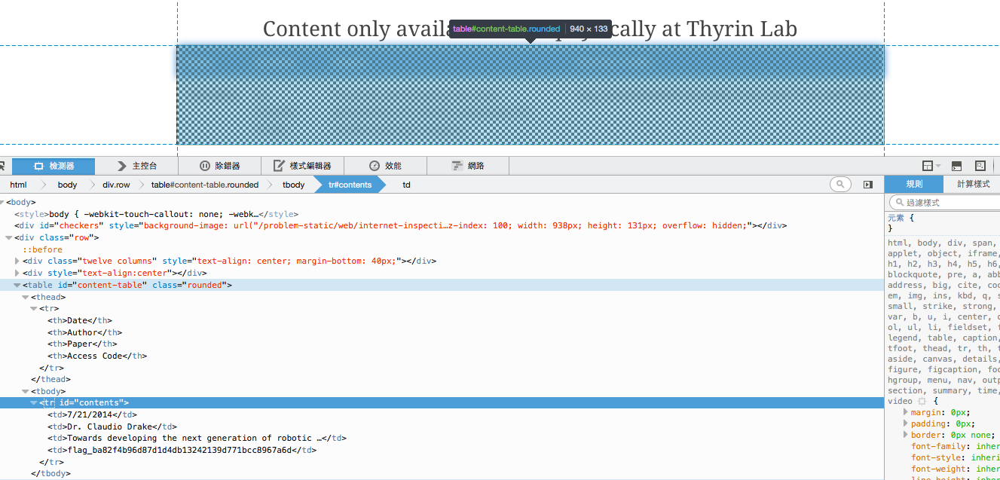

# Internet Inspection

## 題目

種類： Web Exploitation

分數： 30 分

敘述：
> On his computer, your father left open a browser with the Thyrin Lab Website. Can you find the hidden access code?

提示：
> It may be helpful to learn how to 'Inspect Elements' in your browser.

## 解題

這題是網頁題，一開始會先看到一個類似馬賽克畫面：


我的第一個反應是打開原始碼。打開之後似乎沒什麼可疑的東西，最顯眼的是下面這段 code：

```js
$(document).ready(function() {
    // This problem can be solved in much simpler ways than
    // looking at the code below. Browser developer tools
    // are your friend.
    var d=['\x61\x73\x63','\x64\x69\x6f', ...];
    $('#contents').html(m);
    checker();
});
```

看起來似乎有什麼東西被用 16 進位的方式分別儲存起來。

如果直接將陣列 d 丟進 console 的話，可以得到一堆字串：

```
[ "asc", "dio", "e n", "s d", "g_b", ...]
```

可是因為排列打散了，仍然看不出是什麼。如果手動復原需要花很多時間。

可以注意陣列 d 上面有提示說這題有更簡單的解法，因此可以知道絕對不是要手動復原這段字串。

稍微觀察一下網頁會發現那層馬賽克似乎是好幾層的東西疊在一起，我們使用每個瀏覽器都有的開發工具來仔細看看這個網頁。你會發現我們可已利用開發工具一層層地把 HTML 節點一一展開：



透過上圖的結果，我們可以知道原來背後是放了一個表格。其中有個欄位叫做 `Access Code`，而下一行對應的欄位就是 flag 了。
