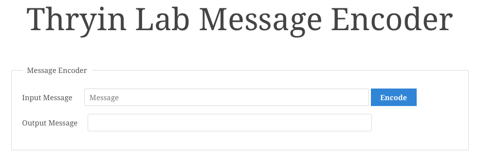
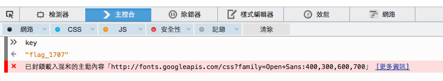

# Javascrypt

## 題目

種類： Web Exploitation

分數： 40 分

敘述：
> Tyrin Robotics Lab uses a special web site to encode their secret messages. Can you determine the value of the secret key?

提示：
> You may want to learn how to use you browser's JavaScript console.

## 解題

這題提供了一個網頁，進去之後可以看到以下畫面：



在上面的區域中輸入文字並按下按鈕後，下面就會顯示出加密的訊息。

打開網頁程式碼可以看到裡面包含著以下 javascript：

```javascript
// Since the key is generated when the page
// is loaded, no one will be able to steal it
// by looking at the source! This must be secure!
function generateKey() {
    var i = 1;
    var x = 250;
    var n = 5493;
    while (i <= 25) {
        x = (x * i) % n;
        i++;
    }
    key = "flag_" + Math.abs(x);
}

generateKey();

// Encode the message using the 'key'
function encode() {                                                        
    var input = $("#inputmessage").val();
    var output = CryptoJS.AES.encrypt(input, key);
    $("#outputmessage").val(output);
}
```

可以發現他們使用了某種 key 來進行加密，而且這個 key 存在一個叫做 `key` 的全域變數中。

雖然我們無法從程式碼中直接看到，不過我們可以透過瀏覽器的 console 直接印出 `key` 的內容：



我們可以看到 `key` 的內容為 `flag_1707`，這就是這題的解答。
